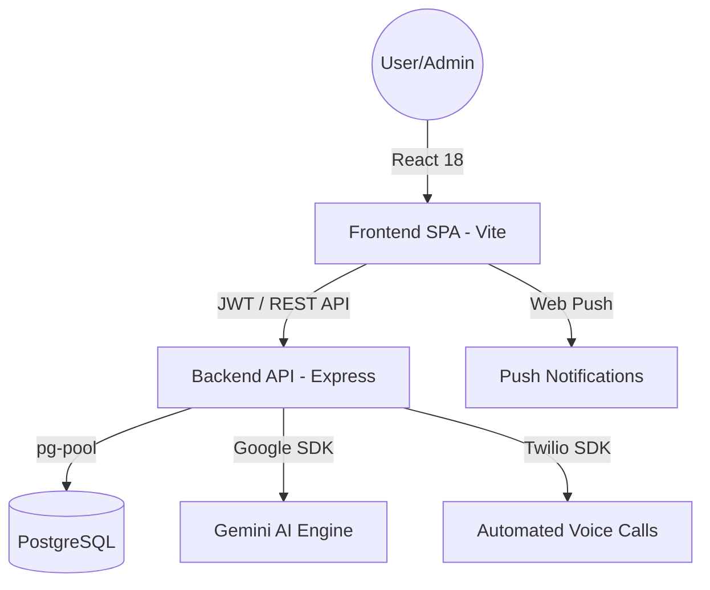

# Zyklus Halo — Enterprise Asset Management System

[](https://github.com/your-repo)
[](https://github.com/your-repo)
[](https://ai.google.dev/)

**Zyklus Halo** is a next-generation Enterprise Asset Management (EAM) system designed for high-performance tracking, intelligent monitoring, and automated lifecycle management of institutional assets. Built with a focus on speed, security, and AI-driven insights.

---

## 🚀 Key Features

### 🧠 Zykla Brain (AI Core)
Powered by **Google Gemini 2.5 Flash**, the system provides advanced cognitive capabilities:
*   **Automatic Alert Generation**: Real-time system analysis detecting anomalies, maintenance needs, and overdue loans.
*   **Semantic Asset Search**: Natural language processing to find assets based on complex descriptions and context.
*   **Intelligence Engine**: Strictly structured JSON outputs ensuring seamless integration with the UI components.

### 📞 Native Notifications & Escalation
A robust communication layer integrated with **Twilio** and **Web Push API**:
*   **Native Voice Calls**: Automated phone calls via Twilio Studio Flow for critical alerts.
*   **Push Notifications**: Real-time web push alerts for loan status, approvals, and reminders.
*   **Smart Escalation Matrix**:
    *   **Pending Approval**: Automated voice call to Manager after 5 minutes of inactivity.
    *   **Preventative Alerts**: Push notifications 48h and 24h before a loan expires.
    *   **Overdue Protocol**: Tiered escalation (Call to User → Call to Manager at 3 days → Critical call to Admin at 7 days).

### 📊 Advanced Analytics & BI
*   **Discipline-Based Drill-down**: Filter entire dashboards by institutional discipline (e.g., Engineering, Arts, Admin).
*   **Real-time KPIs**: Instant tracking of Available, Loaned, and Approved assets.
*   **Interactive Visualizations**: High-performance charts (Recharts) showing category distribution and Top 5 Most Active Users.

### 📦 Lifecycle & Inventory
*   **Bundle Management (Combos)**: Group assets into kits for simplified mass-loaning.
*   **QR-Powered Dispatch**: Mobile-ready workflow for guards to handle check-in/check-out via QR scanning.
*   **Maintenance Orchestration**: Full tracking of maintenance logs and resolution workflows.

---

## 🏗️ System Architecture

Zyklus Halo follows a clean **Decoupled Architecture** (Frontend/Backend) to ensure scalability and ease of deployment.



### Tech Stack
*   **Frontend**: React 18, TypeScript, TailwindCSS, Vite 7, Recharts.
*   **Backend**: Node.js, Express 4, TypeScript, JWT Auth, Bcrypt.
*   **Database**: PostgreSQL (Optimized with custom performance indexes).
*   **Communication**: Twilio Studio Flow, Web Push API (VAPID).
*   **AI**: Google Gemini SDK (Gemini 2.5 Flash).

---

## 🔐 Role-Based Access Control (RBAC)

| Role | Access Level | Responsibilities |
|:---:|:---:|:---|
| **Admin** | Full Access | Global configuration, user management, and advanced analytics. |
| **Manager** | Departmental | Approval/Rejection of requests within their hierarchy. |
| **Auditor** | Read-Only | KPI monitoring, reporting, and system oversight. |
| **Guard** | Operational | QR scanning for asset dispatch and return. |
| **User** | Self-Service | Asset requesting, bundle browsing, and loan tracking. |

---

## ⚙️ Setup & Installation

### 1. Prerequisites
*   Node.js 18+
*   PostgreSQL instance (e.g., Supabase)
*   Google AI API Key (Gemini)
*   Twilio Account (SID, Token, From Number, Flow SID)

### 2. Environment Configuration
**Backend (`backend/.env`):**
```env
TWILIO_ACCOUNT_SID=...
TWILIO_AUTH_TOKEN=...
TWILIO_STUDIO_FLOW_SID=...
VAPID_PUBLIC_KEY=...
VAPID_PRIVATE_KEY=...
```

---

## 📈 Performance & Reliability

The system has been optimized for **Enterprise-scale catalogs** (+10,000 assets):
*   **DB Optimization**: B-Tree indexes on `status`, `category`, and `created_at`.
*   **Network Efficiency**: Gzip compression and paginated endpoints.
*   **QA Validated**: Full E2E suite covering RBAC, Asset Lifecycle, and Communication triggers.

---

*© 2026 Zyklus Halo Engineering. Designed with excellence for industrial asset control.*
